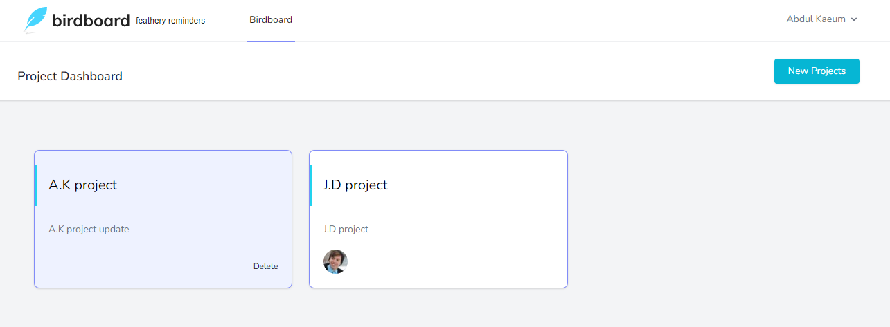

### A Basecamp-like project management application

- Leverages TDD
- Frontend uses Tailwind
- Request validation
- Authorization and policy for users projects
- Test arrangements with factory classes
- Reducing duplication in related views
- Extracting validation into form requests
- Model hooks to create activity feed using observers
- Polymorphic dynamic views for rendering activity feed
- Polymorphic relation for activity feed
- Record model changes before and after 
- Multiple error bags

#### Application features 
- Authenticate users
- Create projects
- Create tasks
- Invite users
- Record activity

#### Screenshots

